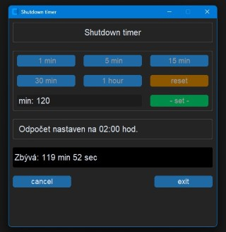

# Shutdown Timer

Jednoduchá aplikace pro naplánování vypnutí, restartu nebo odhlášení systému, vytvořená pomocí knihovny [CustomTkinter](https://github.com/TomSchimansky/CustomTkinter).

## O aplikaci

Tuto aplikaci jsem si vytvořil pro procvičení práce s knihovnou CustomTkinter.  
Shutdown Timer umožňuje:
- Nastavit čas (v minutách) do vypnutí systému.
- Vybrat, zda se má počítač vypnout, (restartovat, nebo odhlásit - in progress).
- Zrušit odpočet před dokončením akce.

## Ukázka aplikace

## Použité technologie
- **Python**: Hlavní programovací jazyk.
- **CustomTkinter**: Pro moderní a přizpůsobitelné GUI.
